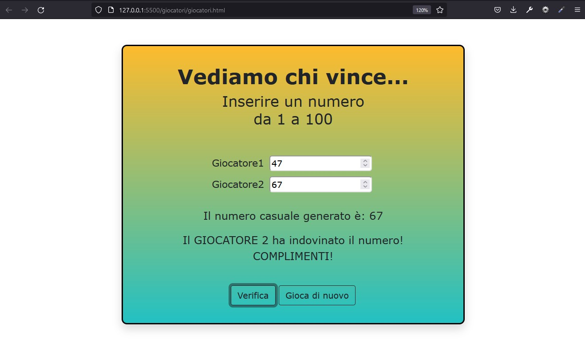
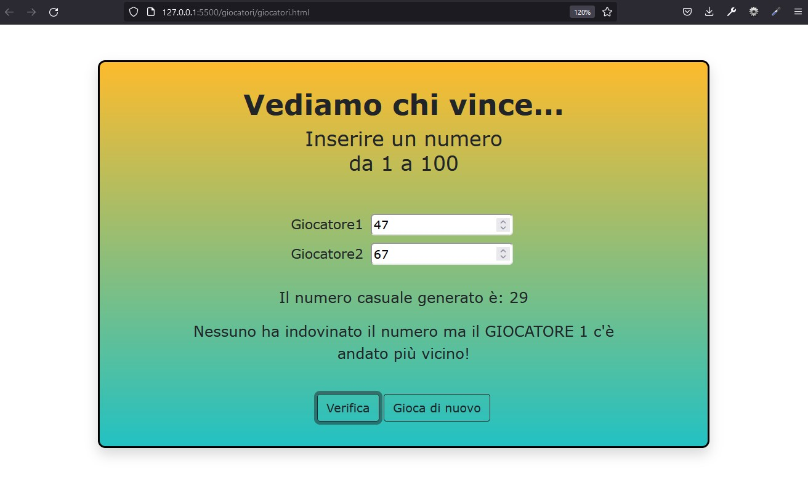

# GuessNumber
Quale giocatore riuscirà ad indovinare il numero segreto?

Giochino molto basilare in cui due giocatori inseriscono un numero da 1 a 100 ciascuno e vince chi indovina il numero esatto o ci si avvicina di più. 
Il numero viene generato randomicamente in JS con Math.random().

 Numero indovinato!  
 Il giocatore 1 ha vinto!  
